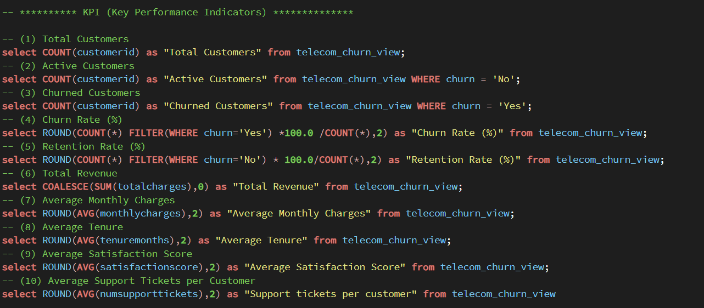
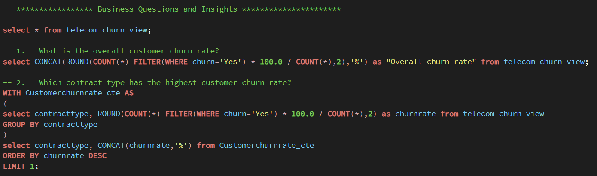
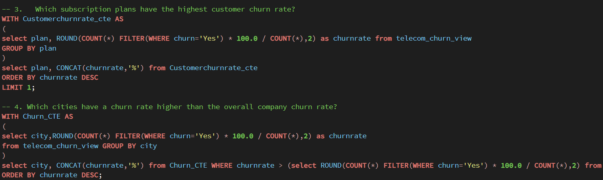
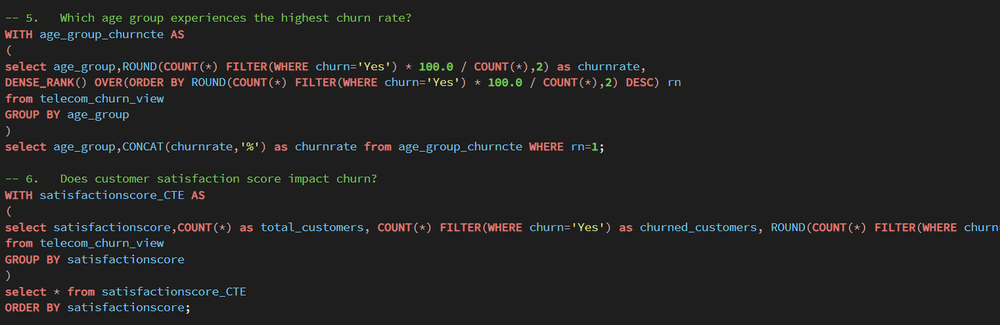
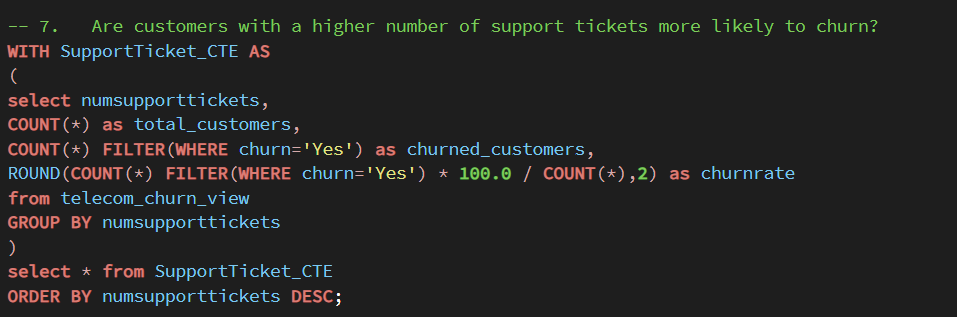
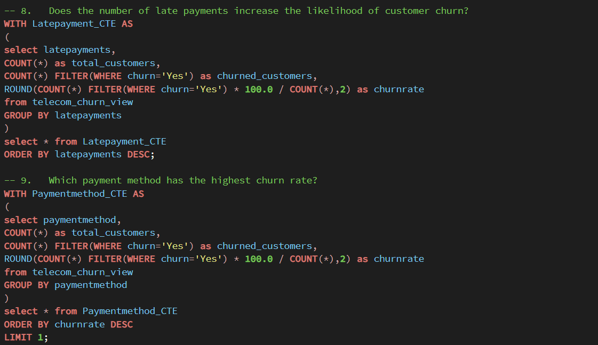
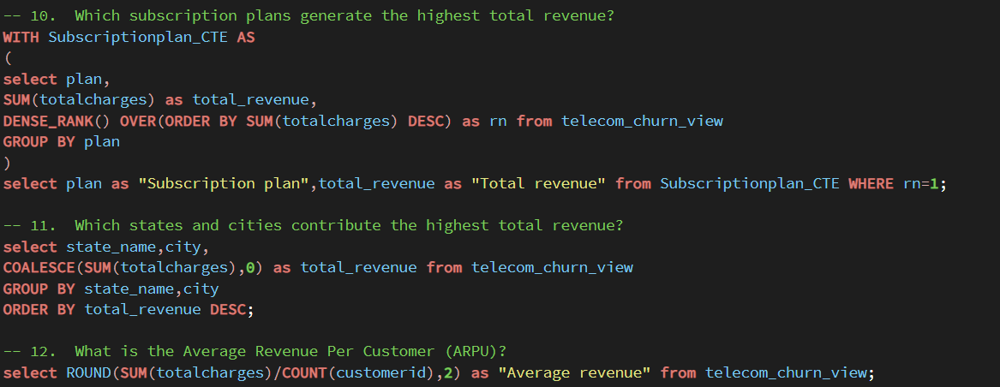
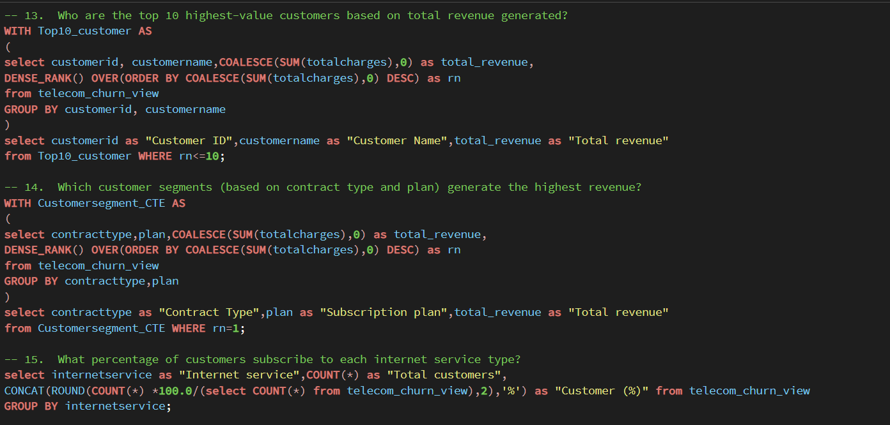
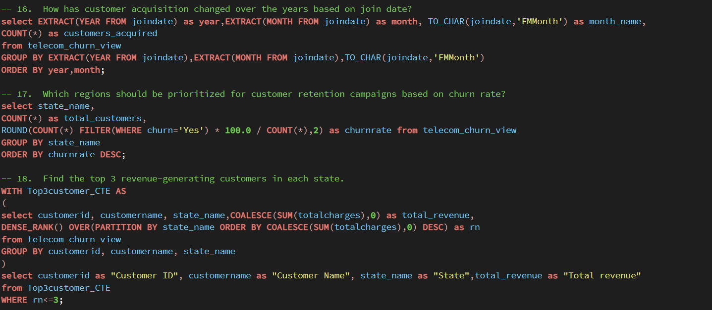
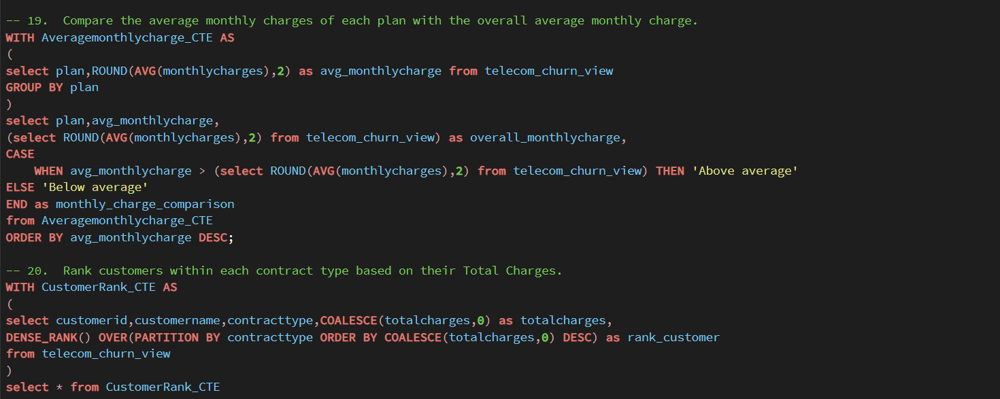

# 📊Telecom-Customer-Churn-Analysis-using-PostgreSQL
This SQL project focuses on analyzing telecom customer data to understand customer churn and identify the key factors influencing customer retention and business performance.

  
## 📌 Project Overview
Customer churn is one of the biggest challenges faced by telecom companies, as retaining existing customers is often more cost-effective than acquiring new ones. This project focuses on analyzing telecom customer data to understand customer churn, customer behavior, revenue trends and business performance using PostgreSQL.

The dataset was initially explored to understand its structure and data quality. Various data cleaning and transformation techniques were applied to prepare the data for analysis. A staging table was created to preserve the raw data, followed by the creation of a SQL view for efficient business analysis.

Using SQL, I answered 20 business-driven questions covering customer churn, customer retention, revenue analysis, customer segmentation and business performance.
The analysis included use of various SQL concepts including aggregations, Common Table Expressions (CTEs), subqueries, window functions, ranking functions, filtering, conditional logic and date functions to extract meaningful business insights from the dataset.

## 🎯 Objectives
<ol>
  <li>Set up a telecom customer churn database and populate it with the data stored in the dataset</li>
  <li>Data Cleaning - find missing values, NULL and do necessary replacements </li>
  <li>Exploratory data analysis - Perform basic EDA to understand the data better</li>
  <li>Business Analysis - Use SQL to answer specific business questions and derive insights from the data.</li>
</ol>

## 📁 Project Structure
### 1. Database and Table setup
   <ul>
     <li>Create database named : telecom_churn_db</li>
     <li> A table named telecom_churn is created to store data in it. The table structure includes columns for CustomerID,CustomerName,Age,Gender,SeniorCitizen,MaritalStatus,Dependent,City,State,Country,JoinDate,TenureMonths,ContractType,Plan,InternetService,TechSupport,
OnlineSecurity,DeviceProtection,StreamingTV,StreamingMovies,PaperlessBilling,PaymentMethod,MonthlyCharges,TotalCharges,NumSupportTickets,SatisfactionScore,
AvgMonthlyGB,LatePayments,Churn </li>
   </ul>

### Database Schema

### 2. Data cleaning and EDA

 <ul>
<li>A staging table was created from the raw dataset to perform cleaning operations. </li>
 <li>Analyzed the dataset structure (rows, columns and data types).</li>
 <li>Checked for NULL (missing) values across all columns.</li>
 <li>Checked for duplicate records.</li>
 <li>Standardized Join Date  to valid date format.</li>
 <li>Standardized categorical values and numerical values.</li>
 <li>Used COALESCE() to handle missing values during analysis where applicable.</li>
 <li>Validated data consistency using MIN(), MAX(), COUNT(), and DISTINCT.</li>
<li>Created a SQL View from the cleaned staging table for business analysis and reporting.</li>
 </ul>

### 3. KPI and Business Questions solved
<h4>💡KPI</h4>
•	Total Customers  
•	Active Customers  
•	Churned Customers  
•	Churn Rate (%)  
•	Retention Rate (%)  
•	Total Revenue  
•	Average Monthly Charges  
•	Average Tenure  
•	Average Satisfaction Score  
•	Average Support Tickets per Customer  
<h4>❓Business questions</h4>
1.	What is the overall customer churn rate? 
2.	Which contract type has the highest customer churn rate? 
3.	Which subscription plans have the highest customer churn rate?  
4.	Which cities have a churn rate higher than the overall company churn rate?  
5.	Which age group experiences the highest churn rate? 
6.	Does customer satisfaction score impact churn? 
7.	Are customers with a higher number of support tickets more likely to churn? 
8.	Does the number of late payments increase the likelihood of customer churn? 
9.	Which payment method has the highest churn rate? 
10.	Which subscription plans generate the highest total revenue?  
11.	Which states and cities contribute the highest total revenue?  
12.	What is the Average Revenue Per Customer (ARPU)? 
13.	Who are the top 10 highest-value customers based on total revenue generated? 
14.	Which customer segments (based on contract type and plan) generate the highest revenue?  
15.	What percentage of customers subscribe to each internet service type? 
16.	How has customer acquisition changed over the years based on join date? 
17.	Which regions should be prioritized for customer retention campaigns based on churn rate? 
18.	Find the top 3 revenue-generating customers in each state. 
19.	Compare the average monthly charges of each plan with the overall average monthly charge. 
20.	Rank customers within each contract type based on their Total Charges.

## 📸 Screenshots

 

## 📈 Insights
★ The company faced an overall churn rate of about 26.26% which indicates that approx. 26 out of every 100 customers discontinued the service.  

★ Customers with One Year contract type have the highest churn rate (27.11%) 

★ Customers with Standard subscription plan have the highest churn rate (27.47%) 

★ Several cities like Lake Kelsey, South Corey etc. have churn rate higher than the overall company churn rate, so must be priortized for targeted retention campaigns. 

★ Customers belonging to age group (46-55) experiences the highest churn rate.  

★ As customer satisfaction score increases, churn rate decreases. 

★ Customers with higher number of support tickets are more likely to churn. 

★ Customers with frequent late payments exhibit higher churn rates. 

★ Customers using Mailed Check as their payment method have the highest churn rate (28.24%) 

★ Standard subscription plan generates the highest total revenue. 

★ Highest revenue is generated by specific state - city combinations, indicating the company's strongest performing geographical areas. 

★ Average Revenue per Customer (ARPU) is $2176.73 

★ A list of the top 10 customers by total revenue highlights the business's most valuable accounts, making them strong candidates for loyalty programs and targeted retention efforts. 

★ Customers subscribed to Standard subscription plan under One year contract type generated the highest revenue. 

★ Fiber is the most widely adopted internet service having 25.44% of customers followed by DSL and Cable. 

★ Customer acquistion has increased, decreased as well as remained stable over time. 

★ Regions with higher churn rates should be priortized for customer retention initiatives. 

★ Every state has a small group of high value customers who contributes majority portion of state level revenue, making them important for retention efforts. 

★ Basic and Standard subscription plans have average monthly charges higher than the company average. 

★ Ranking customers based on contract type will help to identify high value customers to improve retention strategies.

## 📽️ Project Presentation
You can view my complete project presentation here:
<a href="https://canva.link/hwvo77rl62d82xw"> Telecom Churn Analysis PPT </a>

## 🛠️ Tools & Technologies
<ul>
<li>PostgreSQL</li>
<li>pgAdmin 4</li>
<li>SQL</li>
</ul>

If you found this project helpful, consider giving it a ⭐ on GitHub!  Thank you❤️

  <h2>Connect with Me</h2>

